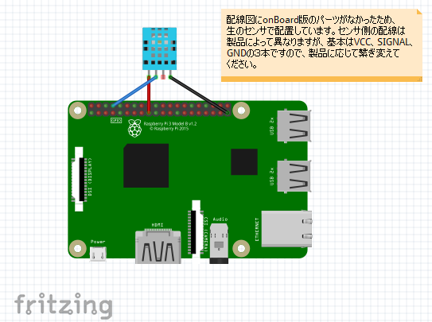
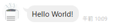
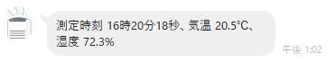
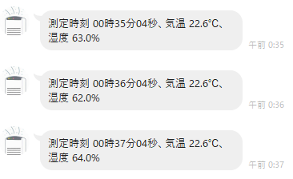

# <span style="color:#22AAFF">センサで温湿度を計測し、AWSにデータを通知する</span>

## <span style="color:#DD8800; ">（RaspberryPi）温度・湿度センサー環境の作成</span>

最初に、RaspberryPiに作業フォルダを作成する。
```
$ mkdir AirCondition
$ cd AirCondition
```

下図のようにRaspberryPiと温湿度センサ「DHT11」を接続する。



GitHubからDHT11のライブラリを取得する。
```
$ sudo git clone https://github.com/szazo/DHT11_Python.git
```

サンプル起動し、以下のように表示されれば接続はOK。

```
$ sudo python3 ./DHT11_Python/example.py

Last valid input: 2021-11-03 22:44:57.427497
Temperature: 21.0 C
Humidity: 84.0 %
Last valid input: 2021-11-03 22:45:03.511665
Temperature: 22.0 C
Humidity: 73.0 %
：
```

このサンプルソースをベースに、内容を作りこんでいく。

```
# サンプルをコピー 
$ sudo cp ./DHT11_Python/example.py ./aircond.py

# gitファイル削除
$ cd DHT11_Python
$ rm -rf .git

# ライブラリ本体のフォルダをひとつ上に移動
$ cd ..
$ sudo mv -f ./DHT11_Python/dht11/ ./dht11

# 不要フォルダ削除
$ sudo rm -rf ./DHT11_Python
```

## <span style="color:#DD8800; ">（AWS）IoT Coreで「モノ」情報を作成</span>

以下の手順で、接続してくるRaspberryPiを、仮想の「モノ」として登録する 
- 「サービス」から「AWS IoT Core」を選択。
- 「管理」から「モノ」(Thing)を選択し、「モノを作成」をクリック
- 「１つのモノを作成」を選んで「次へ」
- 「モノの名前」に任意の名前を入力（「air-condition-pi」）して「次へ」
- 「デバイス証明書」で「新しい証明書を自動生成 (推奨)」を選択して「次へ」
- 「証明書にポリシーをアタッチ」で「ポリシーを作成」をクリック。以下の内容を入力して「作成」をクリック。
  - 名前：任意（例：air-condition-pi-policy）
  - アクション：「iot:*」
  - リソースARN：「*」
  - 効果：「許可」をチェック
- ひとつ前の画面（証明書にポリシーをアタッチ）に戻り、作成したポリシーを選択して「モノを作成」をクリック。
- ここで表示される証明書、プライベートキー、パブリックキーをすべてダウンロードする。

また、RaspberryPiが接続するための、IoTエンドポイントを以下の手順で確認する。
- （AWS IoTメニューの）「設定」をクリック
- 「デバイスデータエンドポイント」にある「エンドポイント」をメモする。

## <span style="color:#DD8800; ">（RaspberryPi）MQTT配信機能の作成</span>

前述のサンプル機能に、MQTTへの配信（パブリッシャ）機能を付与して、AWSと通信させる。

最初に、MQTTクライアントのライブラリをインストールする。

```
$ pip3 install paho-mqtt python-etcd
```

サンプルソースを修正して、MQTTへの配信（パブリッシャ）機能を付与する。  
修正後の[ソースはこちら](./aircond2.py)。  
※ソース上の定義部分「# Mqtt Define」の内容は、前述のデバイスデータエンドポイントや、証明書に置き換えてください。

----
#### ここでのハマりどころ
- 注意点として、<span style="color:#FF4400">取得した証明書や秘密鍵を作業フォルダにコピーしないこと。</span>  
  `「$ git add .」`でうっかりGitHubにアップされてしまうリスクがある。  
  これらがVSSに上がると、GitHubとAWSの双方からセキュリティリスクの通知メールと、  
  アカウント停止警告メールが来ることになり、対応が大変。
----
<br>

## <span style="color:#DD8800; ">（AWS）IoT Coreで計測した温湿度データを受け取る</span>

以下の手順でRaspberryPiから配信された温湿度データを受信（サブスクライブ）する。
- 「サービス」から「AWS IoT Core」を選択。
- 「テスト」>「MQTTテストクライアント」を選択する。
- 「トピックをサブスクライブする」の「トピックのフィルター」に「topicAirCondition」と入力して、「サブスクライブ」を押す。
- 画面に、一定周期で以下のように表示されれば、受信OK。
```
topicAirCondition
November 01, 2021, 22:23:12 (UTC+0900)
{
  "GetDateTime": "2021-11-01 22:23:09",
  "Temperature": 19.8,
  "Humidity": 70
}
：
```

## <span style="color:#DD8800; ">（AWS）受信したデータをDynamoDBに登録する

以下の手順でIoT Coreが受信したセンサデータを、DynamoDBに登録する。
- 「サービス」から「AWS IoT Core」を選択。
- 「ACT」>「ルール」を指定して、以下の流れでルールを追加する。
  - ルール名は任意（「air_condition_entry_rule」）
  - ルールクエリステートメントに、以下の内容を設定。  
    `「SELECT GetDateTime,Temperature,Humidity FROM 'topicAirCondition'」`
  - アクションに「DynamoDBテーブル（DynamoDBv2）の複数列にメッセージを分割する。」を選択。
  - 新しいリソースとして、DynamoDBに任意のテーブルを作成する。
    - テーブル名の名称は任意（「air-condition-data」）
    - パーティションキーは「GetDateTime」とする
    - 「テーブルの作成」ボタンをクリックする。
  - ロールの作成は任意。<span style="color:#FF4400;">「DynamoDB:PutItem」ポリシーを持つロールが必要</span>となる。

DynamoDBサービスで、「テーブル」>「項目の表示」をクリックして、センサから受信したデータが登録されていることを確認する。


----
#### ここでのハマりどころ
- 「ルールクエリステートメント」欄には、初期表示で、サンプルとして`「SELECT * FROM 'iot/topic'」`と書かれている。  
  このサンプルでは、トピック名が（iot/を含む）「iot/topic」ということに注意。  
  パブリッシャ（RaspberryPi）側でトピック名に「iot/」を含めなかった場合は、ここも「~ FROM 'topicAirCondition'」というように、「iot/」は含める必要はない。
- DynamoDBにデータが登録されない場合は、以下の点をチェックすること。
  - （AWS IoT Coreメニューの）「テスト」>「MQTTテストクライアント」を開き、トピックにクエリステートメントのFROM句に書いた内容を入れ、データがサブスクライブ（受信）できること。
  - 「ルール」を編集し、「エラーアクション」としてエラー結果をS3に格納するようにアクションを追加して、再度RaspberryPiからの受信を受ける。S3にログが格納されればその内容を基に対応を行う。
----
<br>

# <span style="color:#22AAFF">DynamoDBへの登録をトリガして、Lineに通知を出す</span>

## <span style="color:#DD8800; ">（LINE Developers）LINEに通知先のチャネルを登録する
[LINE Developers](https://developers.line.biz/ja/)にアクセスし、以下の手順でチャネルを作成する。
- 画面右上から、LINEアカウントでログインする。
- 画面右下で「日本語」を選択。
- メニュー「プロバイダ」>「作成」ボタンをクリック
  - 「プロバイダ名」に任意の名前を設定（「airCondition」）
  - 「Message API」を選択
  - 必須項目を登録して、「作成」ボタンをクリック（内容は任意）
    - チャネル名「お部屋の空調さん」
    - チャネル説明「お部屋の状態をお知らせします。」
    - 大業種「電気・ガス・エネルギー」
    - 小業種「ガス」
- 作成したプロバイダを選択する。Messaging API設定タブを選択する。
  - 表示されるQRコードを、スマホカメラで読み取ると、スマホのLINEに通知チャネルが登録される。
  - 一番下にある「チャネルアクセストークン」をコピーして、控える（通知先として、この後のlambda
に必要）
- Visual Studio Codeを起動して、LINEからピンポンがくるか、動作テスト。
``` json
POST https://api.line.me/v2/bot/message/broadcast
Authorization: Bearer [チャネルアクセストークン]
Content-Type : application/json 

{
    "messages": [
        {
            "type": "text",
            "text": "Hello World!"
        }
    ]
}
```



## <span style="color:#DD8800; ">（RaspberryPi）AWS Lambda用のファンクションを作成する

作業用のフォルダを作成する。
```
$ mkdir aws_lambda
$ cd aws_lambda
$ mkdir airConditionNotifyLineFunc
$ cd airConditionNotifyLineFunc
```
直下に、pythonソースファイル [lambda_function.py](./aws_lambda/airConditionNotifyLineFunc/lambda_function.py) を作成する。  
※ソースコード中の "access_token" は、後ほどlambda上で環境変数として設定する。

このソースファイルに必要なライブラリ「requests」を、カレントディレクトリ上にインストールする。
```
$ pip install requests -t ./
```

ソース＋ライブラリをlambdaへのアップロード用にzip圧縮する。
```
# カレントディレクトリにlambda_function.pyと各種ライブラリがあることを確認
$ ls 
  bin                                 idna-3.3.dist-info
  certifi                             lambda_function.py
  certifi-2021.10.8.dist-info         requests
  charset_normalizer                  requests-2.26.0.dist-info
  charset_normalizer-2.0.7.dist-info  urllib3
  idna                                urllib3-1.26.7.dist-info

$ zip -r airConditionNotifyLineFunc.zip ./*
```

## <span style="color:#DD8800; ">（AWS）LINE通知用のLambda関数を作成する

以下の手順でlambda関数を作成する
- 「サービス」から「Lambda」を選択。
- 「関数」>「関数の作成」画面で、以下を指定して「関数の作成」をクリックする。
  - 関数名：「airConditionNotifyLineFunc」。名称自体は任意だが、前の手順でzip作成した際の、フォルダ名とあわせる
  - ランタイム：Python 3.9
  - アーキテクチャ：x86_64
  - アクセス権限>デフォルトの実行ロールの変更：
    - 「基本的な Lambda アクセス権限で新しいロールを作成」を選択
- 「コード」タブ開く
  - 画面右上の「アップロード元」に「.zip」ファイルを選択する。前の手順で作成したzipファイルを指定して、ソースをアップロードする。
- 「設定」タブ>「アクセス権限」を開く
  - 「実行ロール」に表示されたロール名のリンクをクリック（IAMのロール画面に遷移する）
  - 「ポリシーをアタッチします」をクリックして、次のポリシーを追加
    - `AmazonDynamoDBFullAccess`
- 「設定」タブ>「環境変数」で「編集」ボタンを押して以下の環境変数を追加
  - 「access_token」：LINE Developers画面で控えた、チャネルアクセストークンを設定する。

動作確認。
- 「コード」タブ>「テスト」で、「テスト」ボタンに以下の内容を登録して、テスト実行する。
``` json 
{
    "Records": [
        {
            "dynamodb": {
                "NewImage": {
                    "GetDateTime": {
                        "S": "2021-11-03 16:20:18"
                    },
                    "Temperature": {
                        "N": "20.5"
                    },
                    "Humidity": {
                        "N": "72.3"
                    }
                }
            }
        }
    ]
}
```
実行して、LINEからピンポンがくるか、テストを行う 



<br>

正常にLINEへの通知が来ることを確認できたら、以下の手順でDynamoDBテーブルの変更通知とつなげる。

- 「設定」タブ>「トリガー」で「トリガーを追加」ボタンをクリック
  - 「トリガーの設定」で「DynamoDB」を選択。
    - DynamoDBテーブル：「air-condition」
    - トリガーの有効化：チェック

<br>

トリガーが設定されると、上のLINE通知が1分に1回通知されてくるようになる。



----
#### ここでのハマりどころ
- zip圧縮は、親フォルダを含めず、フォルダの内容だけを圧縮すること。
- 実行Pythonのソースファイル名は「lambda_function.py」とすること。これ以外に変更する場合は、（試していないが）ランタイム設定にあるハンドラ名を変更する必要がありそう。
- lambdaのevent引数に渡されてくるデータ構造がわらかなかった。これは、[こちらのドキュメント](https://docs.aws.amazon.com/ja_jp/lambda/latest/dg/with-ddb.html)か、テストデータ作成画面で表示されるテンプレートを参考にするとよい。
- lambdaが正しく機能しているかは、Cloud Watchログから確認する。ステータスコードが200ではなく429が返っているようであれば、これ ↓ が原因。
- <u><b>LINEへの通知リクエストが多発しないよう注意。</b></u>
  - [レート制限](https://developers.line.biz/ja/reference/messaging-api/#rate-limits)：60リクエスト/時
  
  - [その月の配信可能なメッセージ数の上限](https://www.linebiz.com/jp/manual/OfficialAccountManager/account-settings/)：フリープラン 1,000通/月

  - [開発ガイドライン](https://developers.line.biz/ja/docs/messaging-api/development-guidelines/)：「いかなる目的でも、同一ユーザーへメッセージを大量送信しないでください。」  

  基本的に多くても1分に1回を上限とするのがよさそう。上記いずれかに抵触すると、HTTPステータスコード「429」応答が返るようになる。そうでなくても、開発ガイドラインの記載違反なので、いつBANされるか…。


----


## ElasticSearch


[ここ](https://docs.aws.amazon.com/ja_jp/AWSEC2/latest/UserGuide/set-time.html#change_time_zone)を参考にEC2内の標準時間を、日本の標準時に設定する。


スキーマ定義

``` json 
PUT http://[host_ipaddress]:9200/iot_data/
Content-Type: application/json

{
    "mappings": {
        "properties": {
            "GetDateTime": {
                "type": "date",
                "format": "yyyy-MM-dd HH:mm:ss"
            },
            "Humidity": {
                "type": "float"
            },
            "Temperature": {
                "type": "float"
            }
        }
    }
}
```

データ投入
``` json
POST http://[host_ipaddress]:9200/iot_data/_doc/
Content-Type: application/json

{
    "GetDateTime": "2021-11-03 16:22:58",
    "Humidity": 11.1,
    "Temperature": 11.1
}
```
